# API System Architecture

Scope: backend runtime and source structure under `api/src`.

## 1) Runtime Context

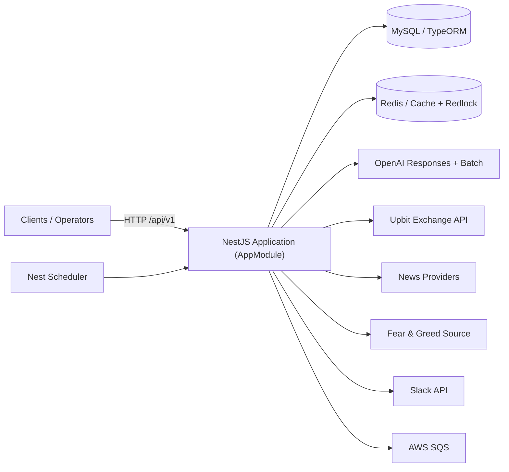

## 2) Source Boundaries

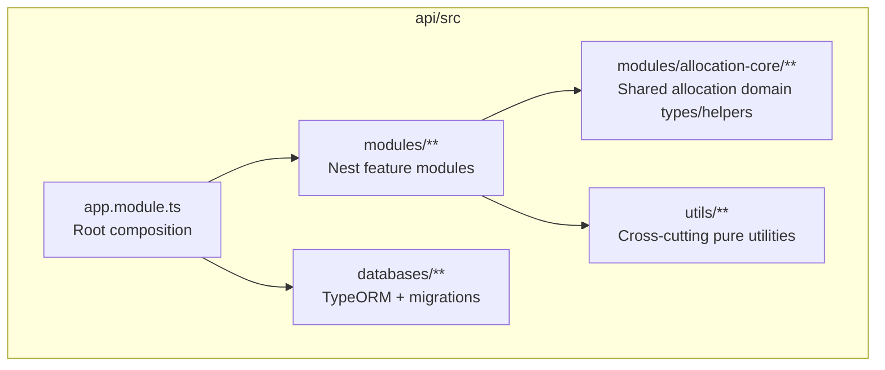

Boundary contract:

- `modules/**`: feature/application code, controllers, entities, services.
- `modules/allocation-core/**`: shared types and pure helpers used by `allocation`, `market-risk`, and related parsing/pipeline code.
- `utils/**`: framework-agnostic utility code. The rule "utils must not import module-layer code" is enforced by `api/src/utils/utils-boundary.spec.ts`.
- `modules/**/prompts/*.prompt.md`: prompt source of truth; `.prompt.ts` files load markdown via `api/src/utils/prompt-loader.ts`.

## 3) Module Topology And Inter-References

### 3.1 Bounded Context Topology

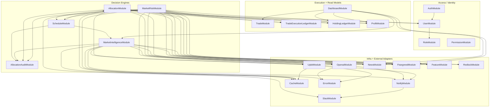

### 3.2 Dependency Degree Index (`*.module.ts` imports)

| Module | Direct Imports | Imported By | Notes |
| --- | ---: | ---: | --- |
| `AllocationModule` | 17 | 1 | Allocation recommendation orchestration + SQS producer/consumer |
| `MarketRiskModule` | 17 | 0 | Volatility monitor + risk-triggered execution |
| `MarketIntelligenceModule` | 11 | 2 | Market signal generation and storage |
| `ErrorModule` | 1 | 8 | Shared retry/fallback and error handling |
| `AllocationAuditModule` | 4 | 4 | Validation run/item lifecycle and calibration |
| `UpbitModule` | 3 | 5 | Exchange adapter and market data access |
| `NotifyModule` | 1 | 7 | User/server notification abstraction |
| `CacheModule` | 0 | 7 | Redis cache access |
| `DashboardModule` | 6 | 0 | Aggregated read model API |
| `ScheduleModule` | 4 | 2 | Schedule config + controlled execution |
| `FeargreedModule` | 2 | 4 | Market sentiment adapter |
| `NewsModule` | 2 | 4 | News adapter |
| `OpenaiModule` | 2 | 4 | LLM calls and batch orchestration |
| `HoldingLedgerModule` | 2 | 3 | Holdings snapshot/ledger updates |
| `UserModule` | 1 | 3 | User aggregate and relations |
| `RedlockModule` | 0 | 4 | Distributed locking |
| `CategoryModule` | 0 | 3 | Category authorization/constraints |
| `FeatureModule` | 0 | 3 | Market feature extraction |
| `ProfitModule` | 0 | 3 | Profit read model |
| `AuthModule` | 2 | 0 | Authentication + role hydration |
| `BlacklistModule` | 0 | 2 | Symbol exclusion rules |
| `SlackModule` | 0 | 2 | Slack transport |
| `TradeExecutionLedgerModule` | 0 | 2 | Idempotency and execution state ledger |
| `RoleModule` | 0 | 1 | Role entity/read/write |
| `TradeModule` | 0 | 1 | Trade history read model |
| `HealthModule` | 0 | 0 | Health probe endpoint |
| `IpModule` | 0 | 0 | External IP utility endpoint |
| `PermissionModule` | 0 | 0 | Permission catalog endpoint |
| `SequenceModule` | 0 | 0 | Sequence generator persistence |
| `TranslateModule` | 0 | 0 | i18n translation bootstrap |

### 3.3 Explicit Reciprocal Module Dependency

- `AllocationModule <-> ScheduleModule`
  - Implemented with `forwardRef` to allow schedule-triggered allocation execution and allocation-side schedule user reads.

No other reciprocal pair was detected in module import edges.

### 3.4 Full Module Import Adjacency

```text
AllocationAuditModule -> ErrorModule, NotifyModule, OpenaiModule, UpbitModule
AllocationModule -> AllocationAuditModule, BlacklistModule, CacheModule, CategoryModule, ErrorModule, FeargreedModule, FeatureModule, HoldingLedgerModule, NewsModule, NotifyModule, OpenaiModule, ProfitModule, RedlockModule, ScheduleModule, TradeExecutionLedgerModule, UpbitModule, UserModule
AuthModule -> CacheModule, UserModule
DashboardModule -> FeargreedModule, HoldingLedgerModule, MarketIntelligenceModule, NewsModule, ProfitModule, TradeModule
ErrorModule -> NotifyModule
FeargreedModule -> CacheModule, ErrorModule
HoldingLedgerModule -> CategoryModule, UpbitModule
MarketIntelligenceModule -> AllocationAuditModule, BlacklistModule, CacheModule, ErrorModule, FeargreedModule, FeatureModule, NewsModule, NotifyModule, OpenaiModule, RedlockModule, UpbitModule
MarketRiskModule -> AllocationAuditModule, CacheModule, CategoryModule, ErrorModule, FeargreedModule, FeatureModule, HoldingLedgerModule, NewsModule, NotifyModule, OpenaiModule, ProfitModule, RedlockModule, ScheduleModule, SlackModule, TradeExecutionLedgerModule, UpbitModule, UserModule
NewsModule -> CacheModule, ErrorModule
NotifyModule -> SlackModule
OpenaiModule -> ErrorModule, NotifyModule
ScheduleModule -> AllocationAuditModule, AllocationModule, MarketIntelligenceModule, RedlockModule
UpbitModule -> CacheModule, ErrorModule, NotifyModule
UserModule -> RoleModule
```

## 4) HTTP Surface (Controller Ownership)

| Module | Base Path | Main Endpoints |
| --- | --- | --- |
| `AuthModule` | `/api/v1/auth` | `GET /roles` |
| `BlacklistModule` | `/api/v1/blacklists` | list/get/create/update/delete |
| `CategoryModule` | `/api/v1/categories` | list/enabled/create/update/delete |
| `DashboardModule` | `/api/v1/dashboard` | `GET /summary` |
| `FeargreedModule` | `/api/v1/feargreeds` | `GET /`, `GET /history` |
| `HoldingLedgerModule` | `/api/v1/holdings` | `GET /` |
| `IpModule` | `/api/v1/ip` | `GET /` |
| `MarketIntelligenceModule` | `/api/v1/market-intelligence` | `GET /market-signals`, `GET /market-signals/cursor`, `GET /latest` |
| `NewsModule` | `/api/v1/news` | `GET /cursor`, `GET /dashboard` |
| `NotifyModule` | `/api/v1/notify` | `GET /`, `GET /log`, `GET /cursor`, `POST /` |
| `PermissionModule` | `/api/v1/permissions` | `GET /` |
| `ProfitModule` | `/api/v1/profits` | `GET /`, `GET /my` |
| `RoleModule` | `/api/v1/roles` | `GET /all`, list/get/create/update/delete |
| `ScheduleModule` | `/api/v1/schedules` | read/update schedule, execution plans, lock state/release, execute task endpoints |
| `SlackModule` | `/api/v1/slack` | config/status/server notify endpoints |
| `TradeModule` | `/api/v1/trades` | `GET /`, `GET /cursor` |
| `UpbitModule` | `/api/v1/upbit` | order/config/status/balances endpoints |
| `UserModule` | `/api/v1/users` | list/get/create/update |
| `AllocationModule` | `/api/v1/allocation` | `GET /allocation-recommendations`, `GET /allocation-recommendations/cursor` |
| `AllocationAuditModule` | `/api/v1/allocation-audit` | `GET /runs`, `GET /runs/:runId/items` |
| `HealthModule` | `/health` | `GET /` |

## 5) Runtime Scenario Flows

### 5.1 Manual Schedule Execution + Lock Control

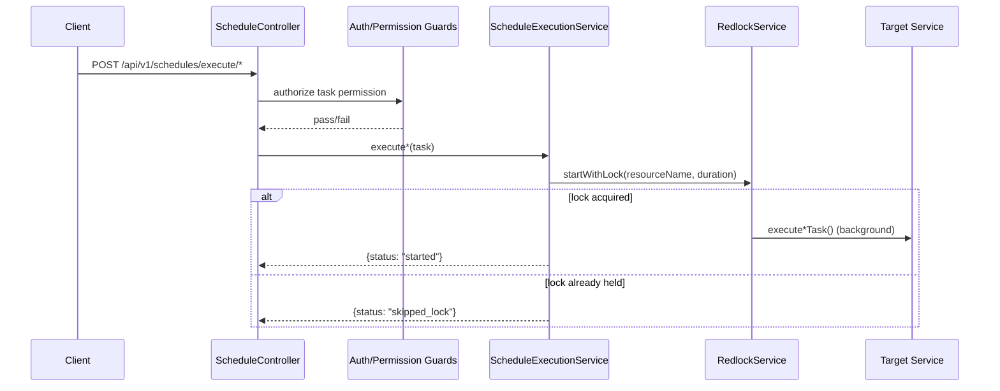

### 5.2 Market Signal Generation (`MarketIntelligenceService`)

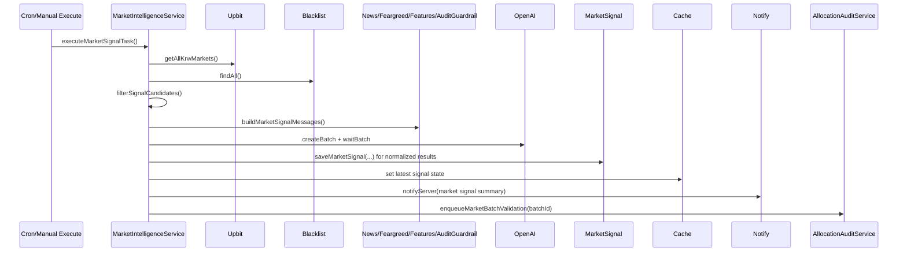

Key behavior:

- Market context fetches use fallback wrappers (`fetchCoinNewsWithFallback`, `fetchFearGreedIndexWithFallback`).
- Validation guardrail text is injected into prompt context when available.
- Latest signal state is cached for downstream freshness checks.

### 5.3 Allocation Recommendation Production + Queue Publish

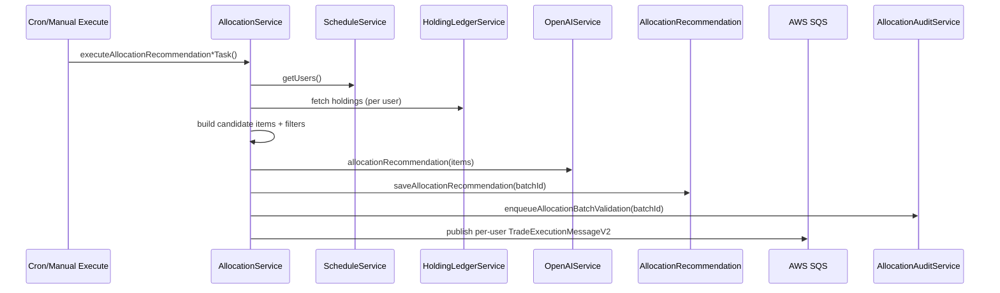

Message envelope fields used by both allocation and risk pipelines:

- `version`, `module`, `runId`, `messageKey`, `userId`, `generatedAt`, `expiresAt`, `inferences`, optional `allocationMode`.

### 5.4 Shared SQS Consumer + Ledger Pipeline (Allocation/Risk)

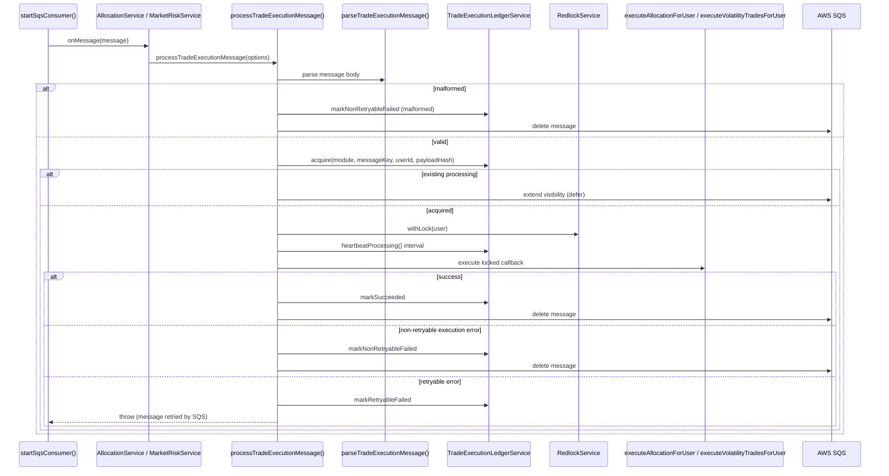

### 5.5 Market Risk Trigger (`MarketRiskService`)

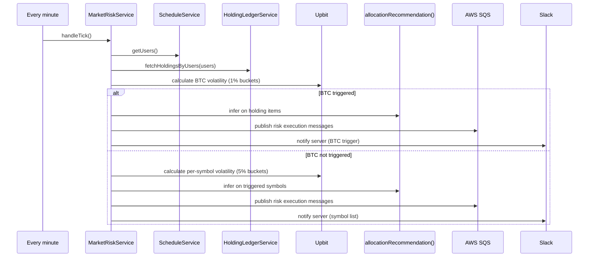

### 5.6 Allocation Audit Lifecycle (`AllocationAuditService`)

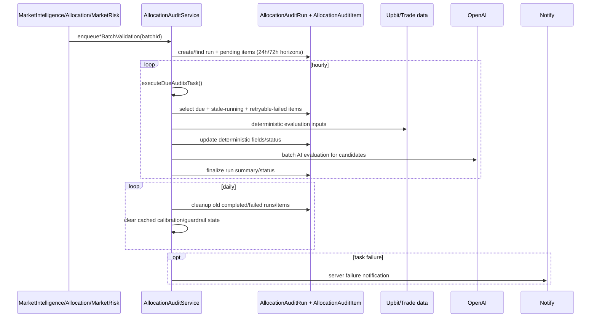

### 5.7 Dashboard Summary Fan-Out

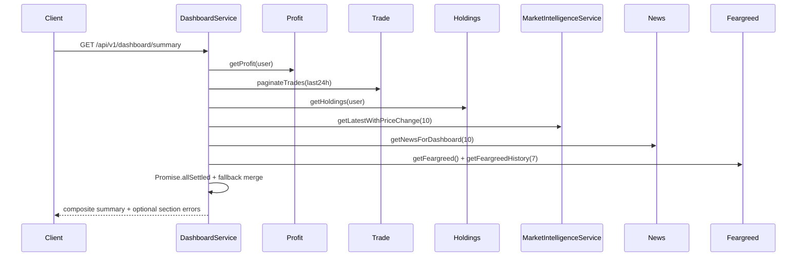

## 6) State Models

### 6.1 Trade Execution Ledger Status

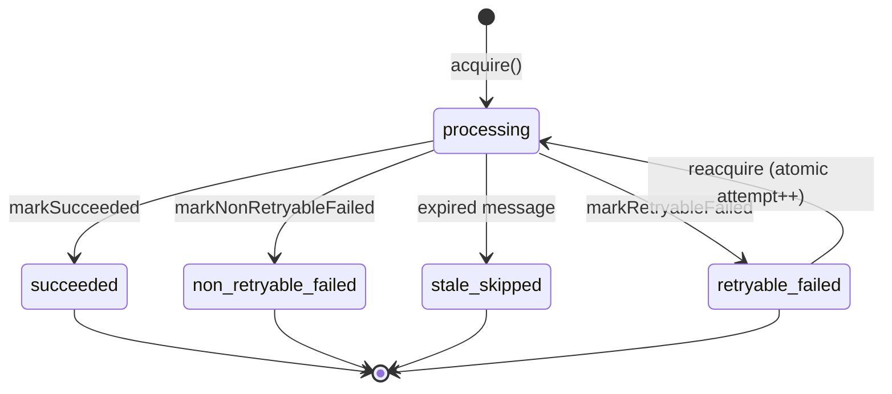

### 6.2 Allocation Audit Item Status

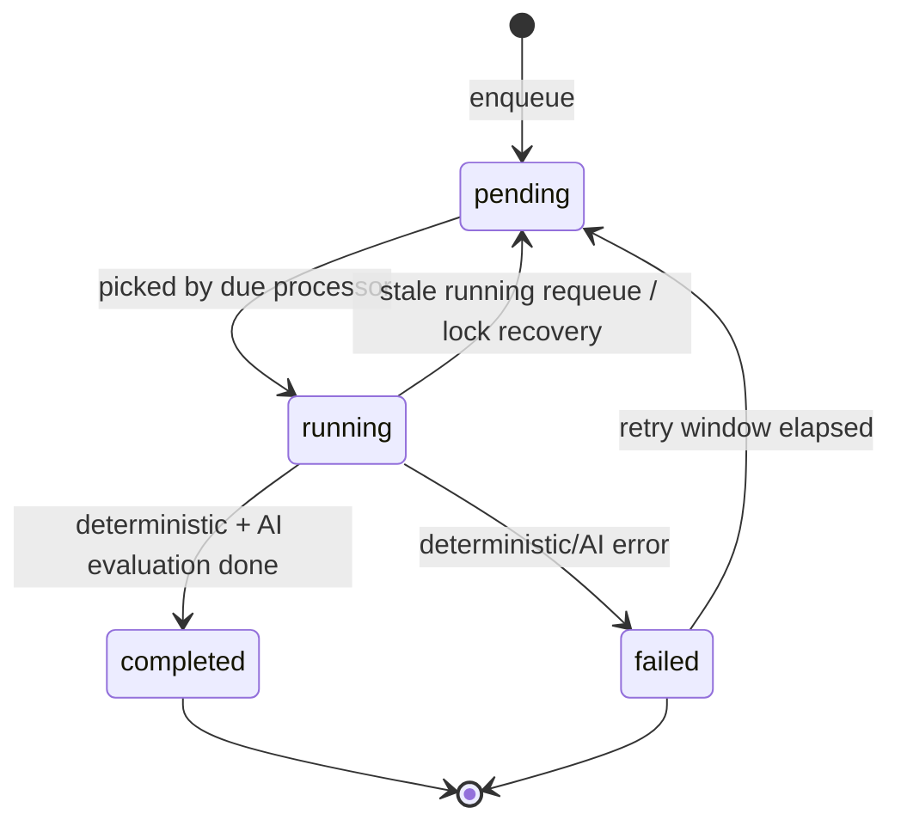

## 7) Data Ownership Map

| Module | Primary Write Models |
| --- | --- |
| `MarketIntelligenceModule` | `MarketSignal` |
| `AllocationModule` | `AllocationRecommendation` |
| `AllocationAuditModule` | `AllocationAuditRun`, `AllocationAuditItem` |
| `TradeExecutionLedgerModule` | `TradeExecutionLedger` |
| `TradeModule` | `Trade` |
| `HoldingLedgerModule` | `HoldingLedger` |
| `ScheduleModule` | `Schedule` |
| `NotifyModule` | `Notify` |
| `CategoryModule` | `UserCategory` |
| `BlacklistModule` | `Blacklist` |
| `UserModule` | `User` |
| `RoleModule` | `Role` |
| `UpbitModule` | `UpbitConfig` |
| `SlackModule` | `SlackConfig` |
| `SequenceModule` | `Sequence` |

## 8) AI Prompt Contract

Prompt source files:

- `api/src/modules/market-intelligence/prompts/market-signal.prompt.md`
- `api/src/modules/allocation/prompts/allocation-recommendation.prompt.md`
- `api/src/modules/market-risk/prompts/allocation-recommendation.prompt.md`
- `api/src/modules/allocation-audit/prompts/allocation-audit.prompt.md`

Loading mechanism:

- Prompt markdown is loaded in corresponding `.prompt.ts` via `loadPromptMarkdown(__dirname, '*.prompt.md')`.
- Shared allocation response schema/config lives in `api/src/modules/allocation-core/allocation-recommendation.prompt.shared.ts`.

## 9) Operational Timing And Lock Values

- Market signal schedule: `0 0 0 * * *`, lock duration `88,200,000 ms`.
- Allocation new schedule: `0 35 6 * * *`, lock duration `3,600,000 ms`.
- Allocation existing schedule: `0 35 0,4,8,12,16,20 * * *`, lock duration `3,600,000 ms`.
- Allocation audit execute schedule: `0 15 * * * *`, lock duration `24h + 5m`.
- Allocation audit cleanup schedule: `0 20 3 * * *`.
- Market risk schedule: every minute (`CronExpression.EVERY_MINUTE`), lock duration `30,000 ms`.
- SQS message TTL in allocation/risk producers: `30 minutes`.
- Processing heartbeat interval in allocation/risk consumers: `60 seconds`.
- Trade execution processing stale threshold (`TradeExecutionLedgerService`): `5 minutes`.
- Market risk cooldowns: symbol `1,800s`, BTC global trigger `3,600s`.
