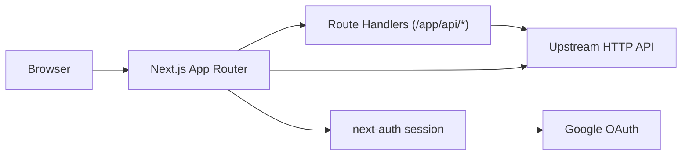
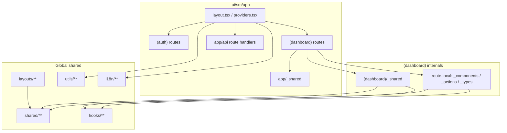
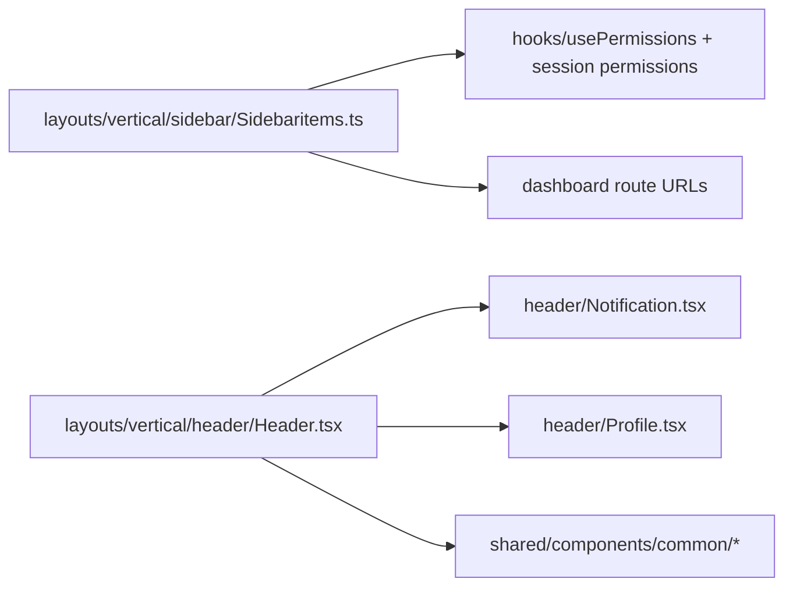
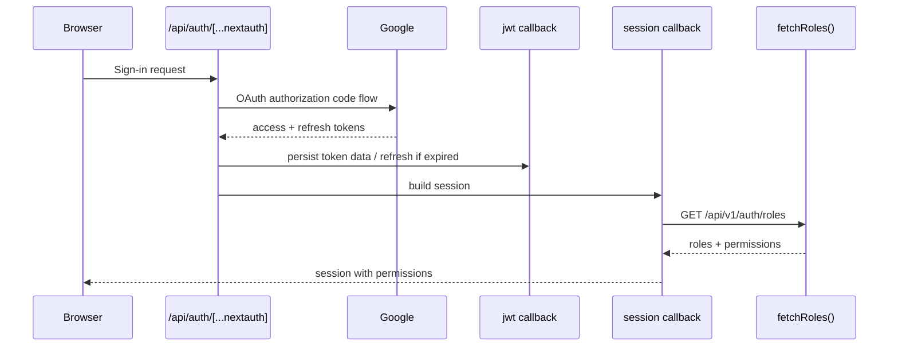
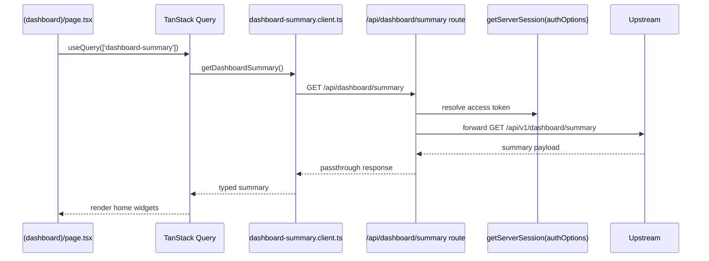
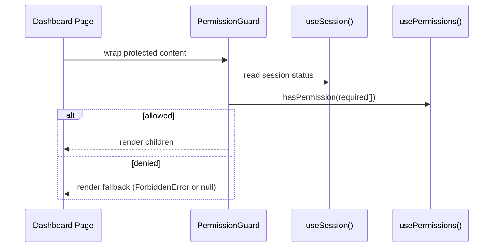
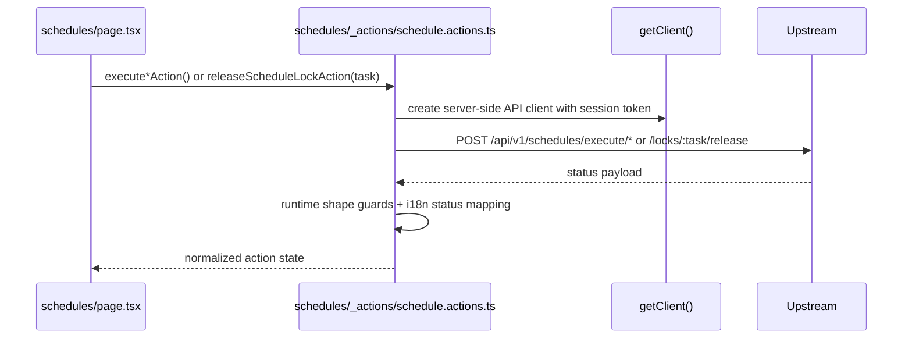
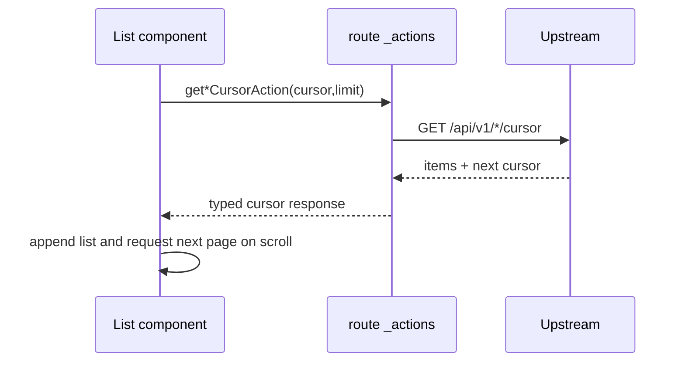

# UI System Architecture

Scope: frontend runtime and source structure under `ui/src`.

## 1) Runtime Context

## 2) Source Boundaries

Boundary contract:

- Route-local private folders (`_components`, `_actions`, `_types`) contain page-specific implementation.
- `(dashboard)/_shared/*` contains reusable dashboard-wide features (auth guard, inference UI, shared table styles, shared settings actions).
- `shared/*` contains app-global reusable UI/types.
- `layouts/*` is the visual shell (header, sidebar, logo).
- `app/api/*` route handlers are BFF endpoints used when session-bound forwarding is needed.

## 3) App Router Topology

```mermaid
flowchart TB
  ROOT["app/layout.tsx"] --> AUTH_LAYOUT["(auth)"]
  ROOT --> DASH_LAYOUT["(dashboard)/layout.tsx"]
  ROOT --> API_ROUTES["app/api/**"]

  AUTH_LAYOUT --> SIGNIN["signin/page.tsx"]

  DASH_LAYOUT --> HOME["/ (dashboard home)"]
  DASH_LAYOUT --> MARKET["/market-signals"]
  DASH_LAYOUT --> ALLOC["/allocation-recommendations"]
  DASH_LAYOUT --> AUDIT["/allocation-audits"]
  DASH_LAYOUT --> NEWS["/news + /news/[id]"]
  DASH_LAYOUT --> TRADES["/trades"]
  DASH_LAYOUT --> PROFITS["/profits"]
  DASH_LAYOUT --> REGISTER["/register"]
  DASH_LAYOUT --> NOTIFY["/notify"]
  DASH_LAYOUT --> SCHEDULES["/schedules"]
  DASH_LAYOUT --> BLACKLISTS["/blacklists + create + [id]"]
  DASH_LAYOUT --> ROLES["/roles + create + [id]"]
  DASH_LAYOUT --> USERS["/users + [id]"]

  API_ROUTES --> AUTH_API["/api/auth/[...nextauth]"]
  API_ROUTES --> SUMMARY_API["/api/dashboard/summary"]
  API_ROUTES --> NOTIFY_CURSOR_API["/api/dashboard/notify/cursor"]
```

## 4) Module Inter-Reference Map (UI Internals)

### 4.1 Page-to-Shared Reference Rules

Common references across dashboard routes:

- permission gate: `ui/src/app/(dashboard)/_shared/auth/PermissionGuard.tsx`
- forbidden fallback: `ui/src/app/(dashboard)/_shared/errors/ForbiddenError.tsx`
- route-specific actions: `ui/src/app/(dashboard)/**/_actions/*.ts`
- route-specific types: `ui/src/app/(dashboard)/**/_types/*.ts`

### 4.2 Action Ownership Matrix

Extracted from `ui/src/app/(dashboard)/**/_actions/*.ts`:

| Action File | Upstream Endpoints |
| --- | --- |
| `.../home/_actions/dashboard-home.actions.ts` | `/api/v1/market-intelligence/latest`, `/api/v1/holdings`, `/api/v1/news/dashboard` |
| `.../home/feargreed/_actions/feargreed.actions.ts` | `/api/v1/feargreeds`, `/api/v1/feargreeds/history` |
| `.../_shared/inference/_actions/inference.actions.ts` | `/api/v1/market-intelligence/market-signals`, `/api/v1/market-intelligence/market-signals/cursor`, `/api/v1/allocation/allocation-recommendations`, `/api/v1/allocation/allocation-recommendations/cursor` |
| `.../_shared/settings/_actions/settings.actions.ts` | `/api/v1/schedules`, `/api/v1/slack/config`, `/api/v1/slack/status`, `/api/v1/upbit/config`, `/api/v1/upbit/status`, `/api/v1/ip` |
| `.../allocation-audits/_actions/allocation-audit.actions.ts` | `/api/v1/allocation-audit/runs`, `/api/v1/allocation-audit/runs/:runId/items` |
| `.../blacklists/_actions/blacklist.actions.ts` | `/api/v1/blacklists`, `/api/v1/blacklists/:id` |
| `.../news/_actions/news.actions.ts` | `/api/v1/news/cursor` |
| `.../profits/_actions/profit.actions.ts` | `/api/v1/profits`, `/api/v1/profits/my` |
| `.../register/_actions/category.actions.ts` | `/api/v1/categories`, `/api/v1/categories/:id` |
| `.../roles/_actions/role.actions.ts` | `/api/v1/roles`, `/api/v1/roles/:id`, `/api/v1/permissions` |
| `.../schedules/_actions/schedule.actions.ts` | `/api/v1/schedules/execution-plans`, `/api/v1/schedules/locks`, `/api/v1/schedules/locks/:task/release`, `/api/v1/schedules/execute/*` |
| `.../trades/_actions/trade.actions.ts` | `/api/v1/trades`, `/api/v1/trades/cursor` |
| `.../users/_actions/user.actions.ts` | `/api/v1/users`, `/api/v1/users/:id`, `/api/v1/roles/all` |

### 4.3 Layout-to-Feature References

## 5) Runtime Scenario Flows

### 5.1 Sign-in + Session Permission Hydration

### 5.2 Dashboard Summary Load (Client Query + BFF)

### 5.3 Permission-Gated Rendering

### 5.4 Schedule Execute / Lock Release Action

### 5.5 Cursor/Infinite List Pattern

## 6) Provider Stack And Cross-Cutting Runtime

`ui/src/app/layout.tsx` and `ui/src/app/providers.tsx` compose runtime wrappers in this order:

1. `ThemeProvider` (Flowbite custom theme)
2. `NextIntlClientProvider` (locale/messages/time zone)
3. `SessionProvider` (next-auth client session)
4. `QueryClientProvider` (TanStack Query cache)
5. `ReactQueryDevtools`

Implications:

- i18n is available in both route components and server actions (`getTranslations`).
- permission checks read from hydrated session permissions.
- server actions use `getClient()` / `getClientWithAccessToken()` for authenticated upstream calls.

## 7) BFF Route Handlers

| Route Handler | Responsibility |
| --- | --- |
| `ui/src/app/api/auth/[...nextauth]/route.ts` | next-auth handler export |
| `ui/src/app/api/dashboard/summary/route.ts` | token-bound proxy for dashboard summary |
| `ui/src/app/api/dashboard/notify/cursor/route.ts` | token-bound proxy for notify cursor stream |

Both dashboard BFF routes:

- enforce token presence from session (`401` if missing),
- forward to upstream with `Authorization: Bearer <token>`,
- preserve upstream status and content type.

## 8) Naming And Placement Rules Used In Source

- Route-facing UI and state: keep in route-local private folders.
- Dashboard-wide reusable features: place in `(dashboard)/_shared`.
- App-wide reusable visual primitives and global types: place in `shared`.
- Layout shell logic: keep in `layouts/vertical/*` and `layouts/shared/*`.
- Access rules:
  - sidebar menu visibility derives from `usePermissions()`.
  - route-level protected content uses `PermissionGuard`.
  - fallback UI uses `ForbiddenError` or route-specific fallback blocks.
